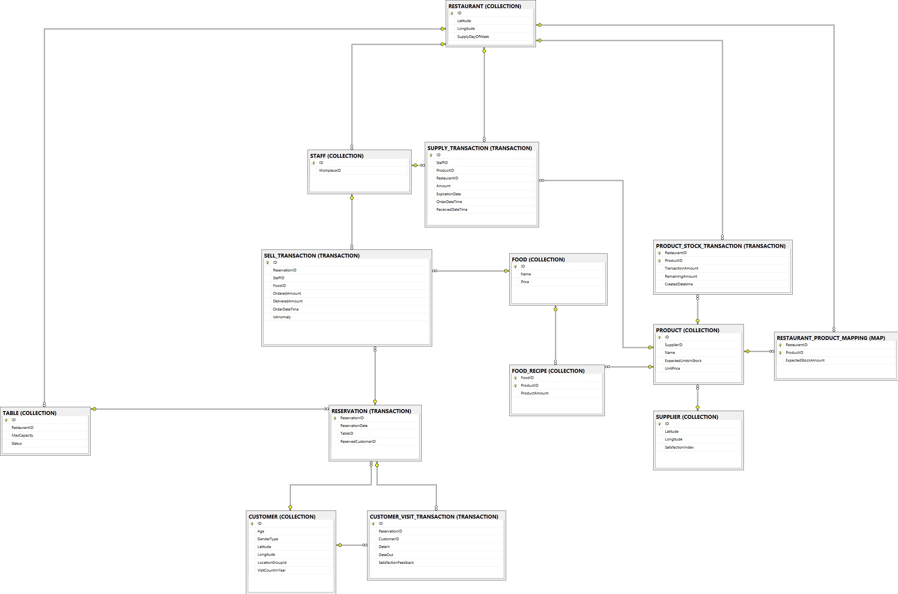
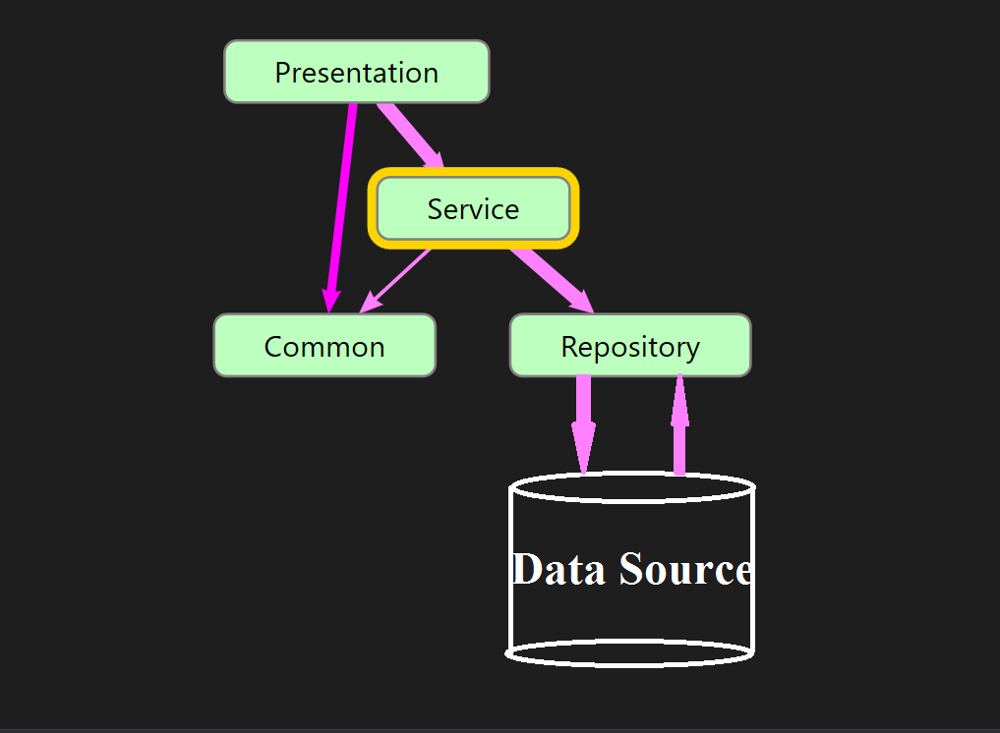
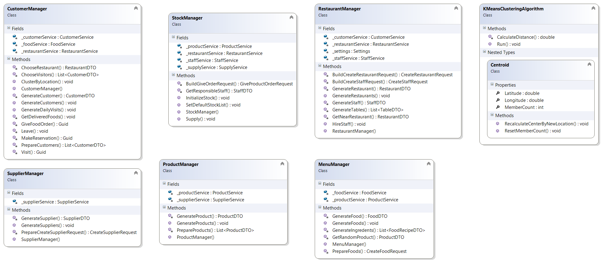
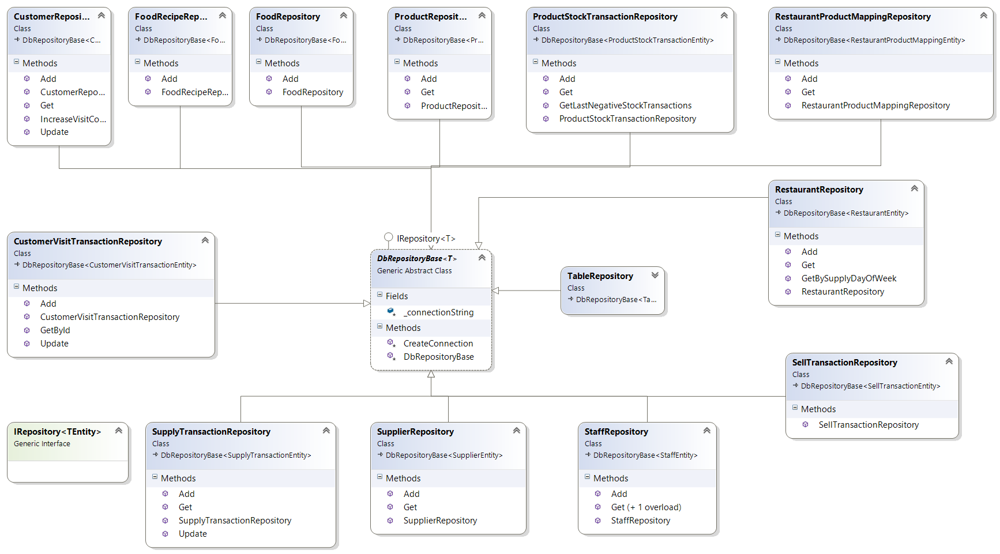
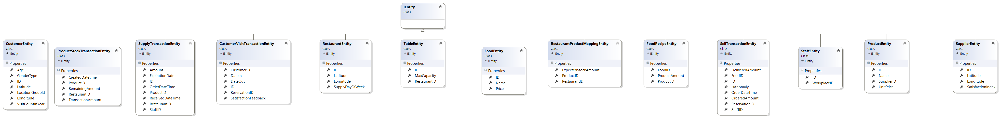
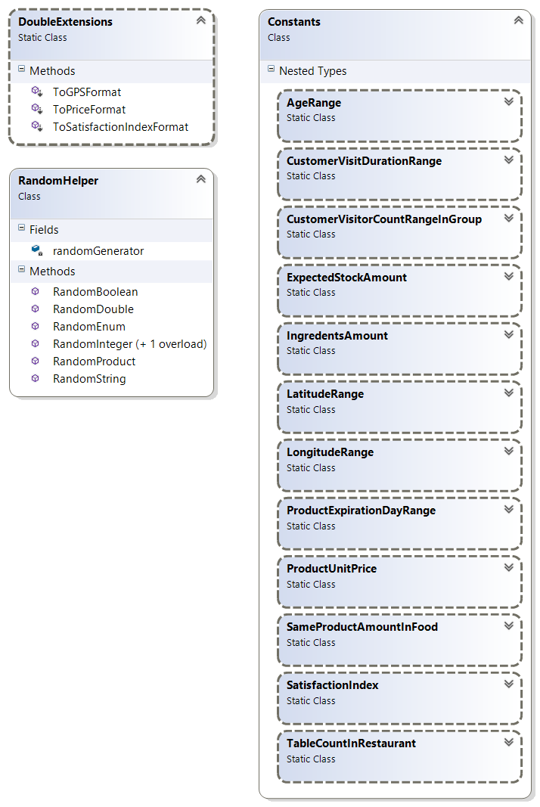

# Prediction

## Summary
Prediction Application for Restaurants.

## Steps To Start The Project
 1. Execute SolutionItems/DbScripts/CreateDB.sql database script on Mssqlserver 2012 or higher version to create database.
 2. Open PredictionApp.sln file with Visual Studio 2015 or higher version.
 3. Press F5 to run project

## Thirdparty Dll's

 - **Dapper**: A high performance Micro-ORM supporting SQL Server
- **Server.System.Configuration.Abstractions**: Interfaced wrappers around System Configuration ConfigurationManager with support for extensibility points and strongly typed helpers.

## Diagrams

### Db Design Diagram

### Solution Diagram

### Class Diagrams

#### Business_Managers
 

#### DataAccess_Repository
 

#### DataAccess_Entities
 

#### Common_Project
 
